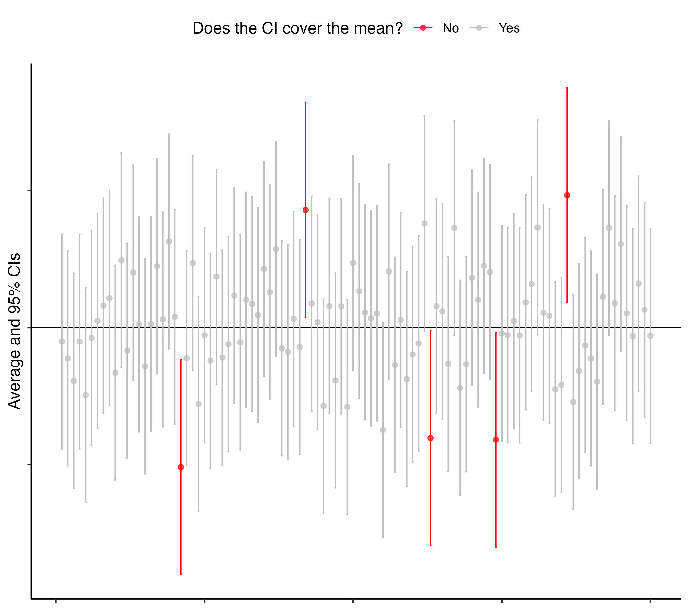

Lot of people, including me, are struggling with the concept of (or idea behind)  confidence intervals. One possible explanation is that understanding confidence intervals requires some capacity of abstract thinking. In the frequentist world, a parameter is a fixed, deterministic number, while an estimator (such as the average) is, by definition, a function of the data and, as such, its value changes from one sample to another (i.e. get a bunch of data multiple times, compute averages, they will likely differ among samples). If confidence intervals are built 'around' estimators, then confidence levels cannot provide the probability of a parameter falling within the interval. Being the parameter a deterministic number, its value will either be covered or not by each of the generated confidence intervals. This will happen with probability 1 or 0, respectively. So, thinking about the parameter as some number (e.g. 3) sometimes falling between two other numbers (i.e. the endpoints of a specific confidence interval) and sometimes not is wrong. If we reverse this idea, so that the endpoints of the confidence intervals sometimes cover the parameter, sometimes not, then we are on the right path. Why? Ask yourself how a confidence interval is generated: compute an estimate (e.g. the average for a given sample), sum and subtract some value to/from it (e.g. plus/minus 1.96 times the standard error of the estimator). As a result, the limits of the interval are themselves random variables. So, the only thing that would change repeating the process of computing a confidence interval would be the value of the estimator (i.e. the estimate) and the endpoints of the interval (the parameter is fixed!). Now, imagine we assume that the estimator we compute from the data is gaussian, meaning it fluctuates symmetrically around the parameter with a given standard error. Being gaussian also means that the estimator will be very far, e.g. at more than 2 standard errors from the mean, a rather low number of times on the long-run (1/40 at each tail of the sampling distribution). So, if we imagine to compute many estimators, let's say again averages, from different set of data, these will fluctuate around the parameter and 1 each 20 will be at more than 2 standard errors from the parameter. On the other hand, 19 out of 20 will, on the long-run, cover the parameter. The figure below is representing that situation. Each average (dot) is computed from a different set of data. The values of the averages are 'normally' (meaning they are Gaussian) fluctuating around the parameter. The error bars represent the endpoints of the confidence interval, built around the averages. Red confidence intervals do not cover the parameter.   

 

<figure>
  
  <figcaption></figcaption>
</figure>
