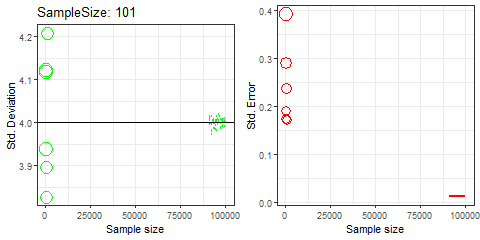

What's the relationship between population variance, sample variance and sample size? This question is pretty broad, and opens up to a lot of interesting issues that have challenged my understanding of the relationship between sample size, variance and bias of estimators.

Let's start with a sample of _N_ observations all generated by the same process. We assume they are _iid_ Gaussian with some mean $\mu$ and variance $\sigma^2$ (they are ~ _N_($\mu$, $\sigma^2$)).
Now, if we ask ourselves whether increasing sample size (_N_) decreases population variance, well the answer is simple and neat: no! Population variance is a parameter, a deterministic number whose value does not depend on sample size.
We may ask ourselves whether adding more data decreases the value of the estimator of the population variance. We can work out the answer.
So, we want to get an idea about how much observations like those in our hands fluctuate around their mean (i.e., we want to estimate $\sigma^2$). We do this using an estimator for the variance, which, as usually in statistics, is built replacing expectations by averages. Wait, what is an expectation? See section 1 at the bottom of the post. Why do we need to replace expectations by averages to get the variance?? Because the true, unknown population variance is computed as the expectation of the squared differences between a random variable and its expected value. Something like the following:

$E[(X - E[X])^2]$

where X is a random variable. For discrete random variables, this translates to the sum of the product of the squared difference between the random variable and its mean times the probability of the occurrence of the random variable (see section 1 for continuous random variables).
Back to our variance estimator, we take the formula of the true, unknown variance, we replace expectations by averages and we are done. We have something like:

$\frac{1}{n}\Sigma(X-\overline{X})^2$

where $\overline{X}$ is the average (an estimator of the expected value of the random variable X). A side note about why we square differences between observations and their average. Summing up negative and positive values would not be a good idea, as they offset. Taking squares of the distances not only solves the issue, but has also the side-effect of giving more weight to large differences. We have our estimator of the variance! We compute $\frac{1}{n}\Sigma(X-\overline{X})^2$ and now we are curious to know what happens if we average over an increasing number of observations? Will the value of our estimator continuously decrease as we add more and more observations? The answer is still no! In the context of estimating $\sigma^2$, the idea that adding more observations leads to a lower variance is mistaken. Then, what happens to our estimator if we add more observations?
To answer this question we need to play a bit with assumptions, distributions and expectations.
First, let's call our variance estimator $s^2$. Following [Cochran's theorem](https://en.wikipedia.org/wiki/Cochran%27s_theorem):

$\frac{n s^2}{\sigma^2}=\chi^2_{n-1}$

What does this mean? Let's focus on the LHS of the equation first. The two _n(s)_ (one multiplies $s^2$, the other one is hidden and it's the $\frac{1}{n}$ that we use to average the sum of squares of the differences between observations and their average) cancel out. So, we are left with something similar to a sum of $Z^2$ random variables (remember we assumed a Gaussian generating process):

$\frac{1}{\sigma^2}\Sigma(X - \overline{X})^2=\Sigma(\frac{(X - \overline{X})}{\sigma})^2$

I just said "something similar to $Z^2$" as $\mu$ is replaced by an average. Nonetheless, Cochran's theorem tells us that this sum of weird $Z^2$ is still $\chi^2$ distributed, but with a number of degrees of freedom that is equal to $n-1$ instead of the $n$ weird $Z^2$. The [$\chi^2$](https://en.wikipedia.org/wiki/Chi-squared_distribution) distribution is nice, as its expected value (see above) is equal to its degrees of freedom and its variance is twice its degrees of freedom. Why did we go through all this? Patience, we are almost there! Now, let's take the expectation of both sides of the above equation:  

$E(\frac{n s^2}{\sigma^2})=E(\chi^2_{n-1})$

There's a rule that says that constants come out as they are from expectations (recall that $\sigma^2$} is a fixed, deterministic number, so essentially a constant). So, we can re-write this last equation as:

$\frac{n}{\sigma^2}E(s^2)=E(\chi^2_{n-1})$

Let's move $\frac{n}{\sigma^2}$ to the RHS and take the expectation of $\chi^2_{n-1}$. We are left with:

$E(s^2)=\frac{n-1}{n}\sigma^2$

Ask ourselves again what happens if we estimate $\sigma^2$ with an increasing number of observations. As _N_ increases the ratio $\frac{n-1}{n}$ goes to 1 and the expected value of our estimator $s^2$ converges to the parameter! This means that as we get more data, the estimator starts fluctuating more and more around the true, but unknown variance (see section 2 at the bottom of this page to know how to compute the bias of $s^2$).

Now, let's work out the variance of $s^2$. Yes, we are dealing with the variance of the estimator of the variance. No surprise here: an estimator is essentially a random variable and, as such, has its own variance (aka sampling variance). We can derive the variance of $s^2$ as we did for its expectation:

$Var(\frac{n s^2}{\sigma^2})=Var(\chi^2_{n-1})$

We apply another rule that says that constants come out squared from variances. Also, we use the fact that the variance of a $\chi^2$ distributed random variable is equal to 2 times its degrees of freedom. We are left with:

$\frac{n^2}{(\sigma^2)^2}Var(s^2)=2*(n-1)$

So, the variance of $s^2$ is:

$Var(s^2)=\frac{2*(n-1)}{n^2}\sigma^4$

In the end, we found something whose value decreases as _N_ increases! Indeed, as we add more observations, the variance of $s^2$ decreases! This makes intuitively sense, as it means that we are able to estimate $\sigma^2$ with increasing precision. The more data we get, the more precisely we can estimate the population variance (and the less biased is our estimator, see above)!

To sum up, when _N_ increases the value of the estimator converges to the true parameter (so it doesn't decrease), but the variance of the estimator does decrease!

Now that we are done, we can check what happens if we use another estimator of $\sigma^2$, one that promises to be unbiased ($s_{unb}^2$, where _unb_ stays for unbiased)! We all know it, as we are used to rely on it:

$\frac{1}{n-1}\Sigma(X-\overline{X})^2$

This other formula takes into account that we had to estimate $\overline{X}$ first. So we are left with $n-1$ degrees of freedom for estimating the variance. Let's derive the expected value and the variance of this estimator:

 $E(\frac{n-1 s_{unb}^2}{\sigma^2})=E(\chi^2_{n-1})$

Following what we did above:

$E(s_{unb}^2)=\frac{n-1}{n-1}\sigma^2=\sigma^2$

We see that the expected value of this estimator does not depend on _N_. The estimator will always fluctuate about the $\sigma^2$.
About its variance:

$Var(\frac{n-1 s_{unb}^2}{\sigma^2})=Var(\chi^2_{n-1})$

Which leads to:

$Var(s_{unb}^2)=\frac{2*(n-1)}{(n-1)^2}\sigma^4=\frac{2}{(n-1)}\sigma^4$

As for $s^2$, the variance of $s_{unb}^2$ decreases as _N_ increases.

To visually represent what I have been writing about so far, just look at the gif below. On the left, we see what happens to $s_{unb}^2$ as more and more data are involved in the computation of the estimator. The value of $s_{unb}^2$ always fluctuates about the true $\sigma^2$ (black solid line), but its variance (how much it fluctuates about the parameter) decreases as _N_ increases. The right panel shows how the standard error (the standard deviation of the sampling distribution) of averages decreases as _N_ increases. This is an old gif. At that time I was curious to see how the variance of averages would decrease at increasing sample size. But the idea equally applies to $\sigma^2$. Notice that for a given _N_, the variance of averages can be computed as:

$Var[\frac{1}{n}\Sigma X]=\frac{1}{n^2} Var[\Sigma X]=\frac{1}{n^2} n\sigma^2=\frac{\sigma^2}{n}$

Here, we use the fact that, under independence, the variance of the sum of _n_ identically distributed random variables is equal to _n_ times their variance. So, the variance of averages depends on _n_.

<figure>
  
  <figcaption></figcaption>
</figure>

### Section 1 - Expectation ($E$)

An expectation is usually denoted by the letter $E$ and represents the mean score that a random variable would assume if we were to repeat an experiment an indefinitely large amount of times (sounds a lot like frequentist approach). We usually repeat an experiment a limited number of times, so, unluckily, we will never be able to get to the expectation. For the moment, we are fine with knowing that the expectation of a random variable is computed as the sum of the product of the value of the random variable times its probability of occurrence (replace sum by integral and probability by density and you get how to compute the expectation of a continuous random variable, sums and probabilities are for discrete cases).

### Section 2 - Derive bias of $s^2$

The bias of an estimator is computed as:

$Bias=E(\overline{\theta} - \theta)$

Basically, is the expected difference between the estimator and the parameter. Imagine to compute a large number of estimates (e.g., values of a number of averages) and sum up the difference between these estimates and the parameter (note that this is possible only if we know the value of the parameter as it is the case in simulations). We are not interested about how much the estimator fluctuates around the parameter. We want to know how much, on average, the estimator is far from the parameter. Hence, this time it makes sense to sum up positive and negative differences and let them offset.
Specifically for $s^2$, we have that:

$Bias=E(s^2 - \sigma^2)=E(s^2) - \sigma^2=\frac{n-1}{n}\sigma^2 - \sigma^2=-\frac{\sigma^2}{n}$

We used another rule for expectations here: the expectation of a sum is equal to the sum of expectations.
Deriving the bias of $s^2$ confirms what we saw above. In short, $s^2$ is downwardly biased, but its bias decreases as _N_ increases.
