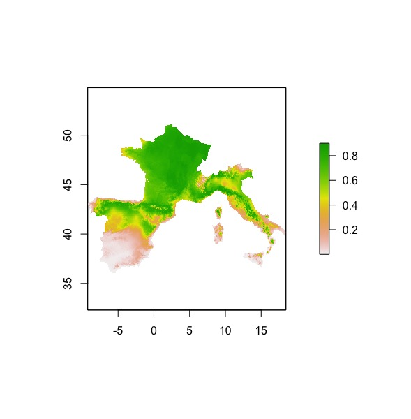
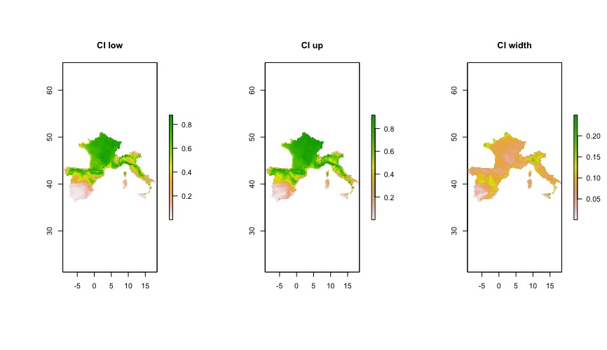

**[WORK IN PROGRESS!!]**

Typical outputs of species distribution models (SDM) are maps of the predicted probability of occurrence of species across the study area. These probabilities of occurrence are estimated from the fitted SDM, and, therefore, inevitably bring uncertainty with them (they are estimated from the data). However, maps representing this uncertainty are seldom reported along with maps of estimated probabilities in scientific papers about SDMs. One possible explanation is that (as far as I know) there are not ready-to-use (_R_) functions to compute (and map) such uncertainty.  

But, first: how to measure such uncertainty? Well, if we are using generalised linear models (GLM), we can use [**confidence intervals**](https://mbazzichetto.netlify.app/blog/post2/). Here, I specifically focus on binomial GLMs, as these are still widely used in SDModelling. Relying on the asymptotic properties of maximum likelihood estimators, we can compute Gaussian confidence intervals. Basically, we assume that our estimators are asymptotically (i.e., as sample size increases) Gaussian.
Why confidence intervals? Because, they combine information on both precision (width of the confidence interval) and accuracy (assumed coverage). Looking at confidence intervals, we have an intuitive representation about how precisely we can estimate parameters (in this post, occurrence probability), plus we have a full range of plausible values for these true, unknown parameters.

The only thing we have to remember is to compute the endpoints of the confidence intervals on the link scale, otherwise the intervals will potentially assume values beyond the range of the parameter.

While working on a paper using SDM, I decided to take write down an R function for mapping the width of confidence intervals associated with the probability of occurrence of _Fagus sylavatica_ (this was the study species). This function does a pretty easy task:

1. the raster layers associated with the predictors (in this case, bioclimatic variables from WorlClim) are coerced to a data.frame object;

2. a grid is overlayed to the study area. This will come handy for computing confidence intervals across wide study areas, as, basically, these get split in small pieces and confidence intervals are computed in each of these pieces;

3. predictions and confidence intervals are computed within each cell of the grid mentioned in step 2;

4. the width of the confidence intervals, along with their lower and upper bounds, are mapped to a raster layer with same resolution (coordinates reference system and so on) of the input raster layers with the predictors.

All we need to make this work is: 1) a fitted model object (at the moment, the function accepts only binomial glm with link logit); 2) a raster stack/brick or whatever list of raster layers that can be coerced to a data frame. Extra-work is needed in case polynomials terms are in the model. Polynomials are considered in the working example provided in this [repo]().

This is the code of the function:

```r
mapping_ci <- function(df.sp, mod, layer_var, rsl = 10, conf.lev = .95) {
  require(sf)
  require(raster)
  stopifnot(exprs = {
    names(coef(mod))[1] == "(Intercept)"
    inherits(mod, what = "glm")
    is.numeric(rsl)
    !is.null(st_crs(df.sp))
    (conf.lev <= 1 && conf.lev >= 0)
  })
  grid_chunks <- st_make_grid(df.sp, n = rsl)
  df.cis <- do.call(rbind, lapply(grid_chunks, function(i) {
    df.sub <- df.sp[i, ]
    if(nrow(df.sub)) {
      mat.ci <- cbind(1, as.matrix(st_drop_geometry(df.sub)))
      df.sub$se <- as.vector(sqrt(diag(mat.ci %*% tcrossprod(vcov(mod), mat.ci))))
      df.sub$fitted <- as.vector(mat.ci%*%unname(coef(mod)))
      df.sub$ci_lb <- with(df.sub, plogis(fitted - qnorm(1 - (1 - conf.lev)/2)*se))
      df.sub$ci_ub <- with(df.sub, plogis(fitted + qnorm(1 - (1 - conf.lev)/2)*se))
      df.sub$ci_width <- with(df.sub, ci_ub - ci_lb)
      return(df.sub)
    } else {
      return(df.sub)
    }
  }))
  df.cis.xy <- st_coordinates(df.cis)
  map_ci_lb <- rasterize(x = df.cis.xy, y = layer_var, field = df.cis$ci_lb, fun = mean)
  map_ci_ub <- rasterize(x = df.cis.xy, y = layer_var, field = df.cis$ci_ub, fun = mean)
  map_ci_width <- rasterize(x = df.cis.xy, y = layer_var, field = df.cis$ci_width, fun = mean)
  ci_stack <- stack(map_ci_lb, map_ci_ub, map_ci_width)
  names(ci_stack) <- c("CI_low", "CI_up", "CI_width")
  return(ci_stack)
}
```
##### Arguments of the function

**df.sp** is an [sf](https://cran.r-project.org/web/packages/sf/index.html) object with each column being a spatial predictor used in the SDM and a geometry column with the coordinates of the corresponding rasetr cell.

**mod** is the fitted binomial glm with link logit.

**layer_var** is a raster layer, which will be used in **rasterize** to map the computed values associated with the confidence intervals (lowe bound, upper bound and width).

**rsl** is the resolution of the grid overlayed to the study area to compute the confidence intervals in chunks.

**conf.lev** is the desired confidence level for the confidence interval.

##### Below, an example of the what we can get from the function:

<br>

##### Map of the predicted probabilities of Fagus syl.

<figure>
  
  <figcaption></figcaption>
</figure>

##### Map of values associated with the confidence intervals

<figure>
  
  <figcaption></figcaption>
</figure>

<br>

**WARNING**: be aware that the function must be used for mapping confidence intervals across the study area. Avoid extrapolating predictions outside the range of predictors values used to train the models. The correlation among predictors may be different, as well as the relationship between them and the response.

Don't hesitate to contact me if you find mistakes or want to help me making this more efficient/general!
